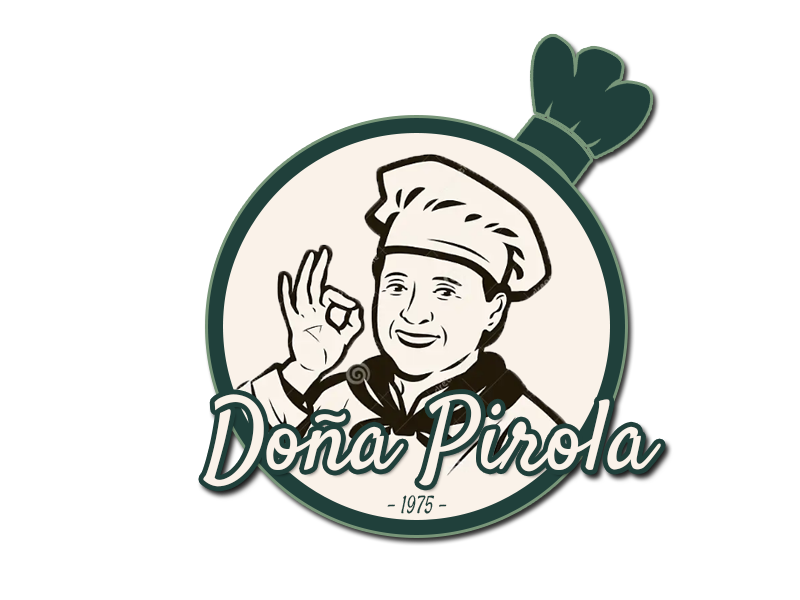

# Doña Pirola - Blog de Recetas

Crea una aplicación web, que permita mostrar un blog de recetas de cocina en una página, desde otra pagina debo poder agregar, modificar o quitar las recetas y estas deben estar almacenadas en el localstorage o json-server.

## Enlace del Proyecto: 
[Doña Pirola](https://github.com/juanchyquintana/blogRecetasRolling)



## Participantes del Proyecto 😄
- Sheyla Astorga ✅

## Librerías 📖
- Bootstrap v5.3.2
- React-Bootstrap
- React-Form-Hook
- React-router-dom
- SweetAlert v2
- mongoose
- express

## Pasos para clonar el proyecto
1. Abre la terminal en el lugar que desees.
2. Copia y pega el siguiente código:

``` 
git clone https://github.com/juanchyquintana/blogRecetasRolling
```

3. npm install 
4. npm run dev
